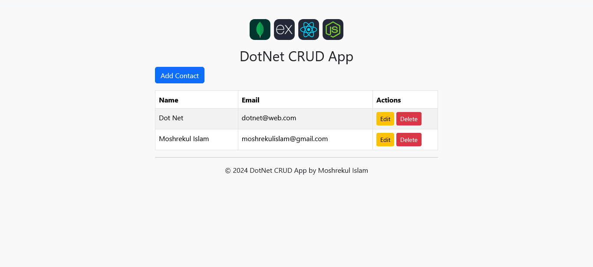

<div style="display: flex; align-items: center; gap: 10px;">
  
</div>

# DotNet CRUD App with PostgreSQL and Nginx in Docker 

A lightweight, production-ready CRUD web application built using `ASP.NET Core (.NET 10)`, `PostgreSQL`, and `Nginx` as a reverse proxy — all containerized with Docker and Docker Compose.

**Note: A version of the project in Traefik can be found here:** [DotNet CRUD App with PostgreSQL and Traefik](https://github.com/mirakib/dockerize-dotnet-app-with-postgres-and-traefik)

## Features
- Full CRUD functionality for managing contacts
- Responsive UI built with Bootstrap
- Containerized with Docker for easy deployment
- Uses PostgreSQL for data storage
- Nginx as a reverse proxy for improved performance and security

## Technologies Used

| Technology | Version | Purpose |
|-------------|----------|----------|
| **DotNet** | 10.x | Framework for building the web application |
| **EF Core** | 9.x | Object-Relational Mapper (ORM) framework  for data access.|
| **PostgreSQL** | 17.x | Database for storing contact information |
| **Nginx** | stable-alpine | Reverse proxy server |
| **Docker** | 28.x+ | Containerization platform |


## Project Structure

```
.
├── docker-compose.yml
├── nginx
│   └── default.conf
├── README.md
└── src
    └── ContactsWeb
        ├── appsettings.json
        ├── ContactsWeb.csproj
        ├── Data
        │   └── AppDbContext.cs
        ├── Dockerfile
        ├── Models
        │   └── Contact.cs
        ├── Pages
        │   ├── Create.cshtml
        │   ├── Create.cshtml.cs
        │   ├── Delete.cshtml
        │   ├── Delete.cshtml.cs
        │   ├── Edit.cshtml
        │   ├── Edit.cshtml.cs
        │   ├── Index.cshtml
        │   ├── Index.cshtml.cs
        │   ├── Shared
        │   │   └── _Layout.cshtml
        │   ├── _ViewImports.cshtml
        │   └── _ViewStart.cshtml
        ├── Program.cs
        └── wwwroot
            └── css
                └── site.css

```

## Getting Started

1. **Clone the repository:**
   ```bash
   git clone https://github.com/mirakib/dockerize-dotnet-crud-app-with-postgres.git
   ```
   ```
    cd dockerize-dotnet-crud-app-with-postgres
   ```
2. **Build and run the application using Docker Compose:**
   ```bash
    docker-compose up --build
    ```
3. **Access the application:**
   Open your web browser and navigate to `http://localhost:8080`.

4. **Stop the application:**

   ```bash
    docker-compose down
    ```

## Output Screenshot




## Contributions
Contributions are welcome! Please open an issue or submit a pull request for any improvements or bug fixes.

